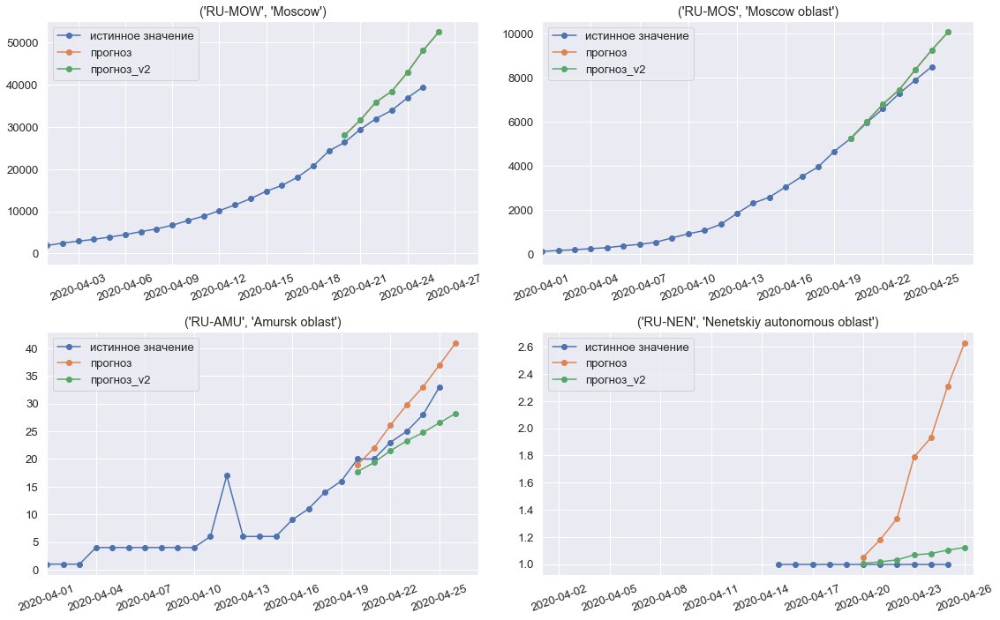

# Baseline для соревнования Sberbank COVID-19 Data Challenge

Ссылка на соревнование: https://ods.ai/competitions/sberbank-covid19-forecast

## Тетрадка с решением: [baseline.ipynb](baseline.ipynb)

## Основные идеи:

- **Объекты выборки** - тройки:
  - `iso3` - конкретный регион или страна,
  - `date` - дата, относительно которой хотим сделать прогноз,
  - `shift` - сдвиг в днях, на который хотим сделать прогноз.
- В качестве **таргета** используем **приращение** заболевших/умерших относительно даты date,  т.е. `target(iso3, date, shift) = confirmed(iso3, date + shift) - confirmed(iso3, date)`
- Используем одиночную xgboost модель, при этом несмотря на то что деревья не умеют прогнозировать тренд, благодаря таргетам-приращениям, эта проблема решается.
- В качестве **факторов** все достаточно бедно и используются:
  - **статистики по заболевшим**, насчитанные по историческим данным (средние и медианы для разных временнЫх окон);
  - всего два признака регионов: **population** и **urban_pop_rate**;
  - в baseline это все - здесь могли бы быть ваши факторы :) 

- *Дополнительно*: на данных с последней известной недели пробуем **дотюнить общую базовую модель** линейным преобразованием прогнозов и делаем это **внутри каждого региона независимо**. 
  - **осторожно**: несмотря на настройку для каждого региона всего одного коэффициента, есть риск переобучиться под тест и в итоге получить худшее качество по сравнению с базовой моделью :)

## Прогнозы модели на вторую неделю конкурса

(По Москве и Мос. области в доп части коэффициент в линейном преобразовании получился равным 1.0 - поэтому оранжевая и зеленая линии наложились)

### Чем полезно использование приращений в логарифмической шкале?

Приращения таргета в логарифмической шкале (особенно в период ~эксп роста распространения вируса) неплохо приближаются константой - а значит деревянная модель справится с этой задачей:

