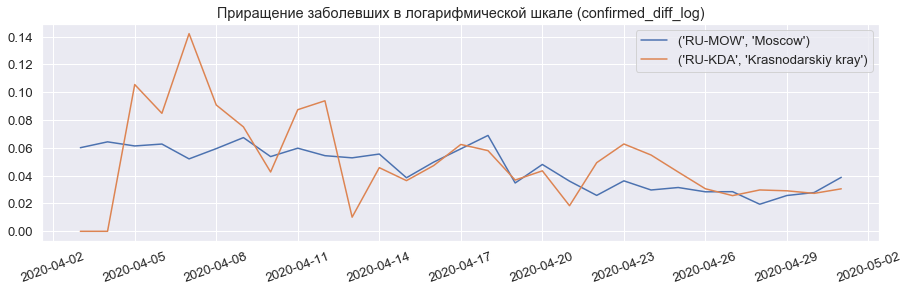

# Решение для соревнования Sberbank COVID-19 Data Challenge

Ссылка на соревнование: https://ods.ai/competitions/sberbank-covid19-forecast

## Тетрадки с итоговым решением:
- [solution_prepare_data.ipynb](solution_prepare_data.ipynb) - подготовка исторических данных;
- [solution_model.ipynb](solution_model.ipynb) - основная часть;

## Основные идеи:

- **Объекты выборки** - тройки:
  - `iso3` - конкретный регион или страна,
  - `date` - дата, относительно которой хотим сделать прогноз,
  - `shift` - сдвиг в днях, на который хотим сделать прогноз.
- В качестве **таргета** используем **приращение** заболевших/умерших относительно даты date,  т.е. `target(iso3, date, shift) = confirmed(iso3, date + shift) - confirmed(iso3, date)`
- В качестве базовой модели используем xgboost, при этом несмотря на то что деревья не умеют прогнозировать тренд, благодаря таргетам-приращениям, эта проблема решается.
- В качестве **факторов** используются:
  - **статистики по заболевшим** для конкретного региона/страны, насчитанные по историческим данным (средние и медианы для разных временнЫх окон);
  - усредненные **статистики по заболевшим** из предыдущего пункта - на уровне всех стран(суммарно) и всех регионов(суммарно);
  - два признака регионов: `population` и `urban_pop_rate`;
  - относительное число заболевших `confirmed_rel` (нормируем на население);
  - `confirmed_ge_N` - есть ли хотя бы N заболевших (N = 1,2,3,5,10)
- В итоговой модели усредняем предсказания 10 базовых моделей, обученных с разным стартовым random_seed.

#### Как использовать возможность выбора двух сабмитов:

- Первый сабмит - прогнозы согласно модели;
- Второй сабмит - все прогнозы-приращения умножаем на 0.9 (было замечено, что такая пессимизация может хорошо работать и на кросс-валидации)

## Прогнозы модели на третью финальную неделю конкурса*

\* если бы модель обучалась на корректных данных, подробности ниже.

## Фактор случайности - Ненецкая АО и некорректные данные

В качестве исходных данных для финальных сабмитов я использовал только данные из таблицы Роспотребнадзора
https://docs.google.com/spreadsheets/d/1Re1TOpN32DY6_iFQNfY8D-bFqBw_gMQKZG7Mg7iRNqQ

В них была серьезная ошибка для Ненецкой АО и для некоторых других регионов(но не такая большая).
- Табличка: для RU-NEN на 26.04 как будто бы было 28 заболевших (перепутали при заполнении два раза Ненецкую АО и Ямало-Ненецкий АО)
- Факт: для RU-NEN на 26.04 реально только 2 заболевших

Фактор случайности в том, что 27.04 и 28.04 в RU-NEN добавилось **11 и 18** заболевших</h3>

На графике выше можно видеть, что модель, **обученная на корректных данных**, такой резкий скачок НЕ предсказывает.

С выбранной организаторами функцией штрафа - штраф за один лишь этот регион в каком-то смысле "перекрывает" старания и точность прогнозов на всех остальных регионах.

## Дополнительно

### Что НЕ зашло
- всякие рейтинги по регионам (парсил с riarating), в итоге ни один из них не используются, т.к. на валидации становилось только хуже;
- кол-во дней со старта карантина/с первого заболевшего/умершего. Объяснил это тем, что на каждой следующей неделе значения данных факторов смещаются в бОльшую сторону, а для деревьев это плохо;
- обучение 7 отдельных моделей для каждого сдвига (на 1 день, на 2 дня, ...на 7 дней);
- этап с дообучением линейного преобразования прогнозов внутри каждого региона по последней неделе (для стран это хоть как-то работало, для регионов только хуже становилось).

### Чем полезно использование приращений в логарифмической шкале?

Приращения таргета в логарифмической шкале (особенно в период ~эксп роста распространения вируса) неплохо приближаются константой - а значит деревянная модель справится с этой задачей:

